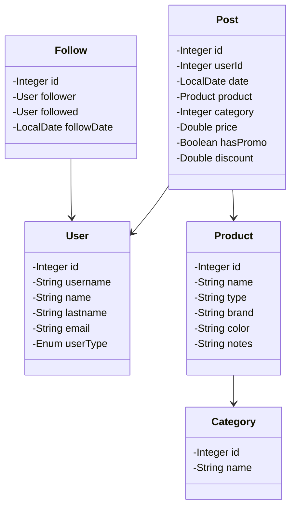

# be_java_hisp_w29_g07
## You can find the related documents in resources folder
### Seeds:
#### [Users.json](./src/main/resources/users.json)
#### [Posts.json](./src/main/resources/posts.json)
### Postman collection:
#### Resources -> Sprint1Collection
### Swagger:
#### Url -> http://localhost:8080/swagger-ui/index.html#/
### Class Diagram: 
#### Resources -> classDiagram.md

