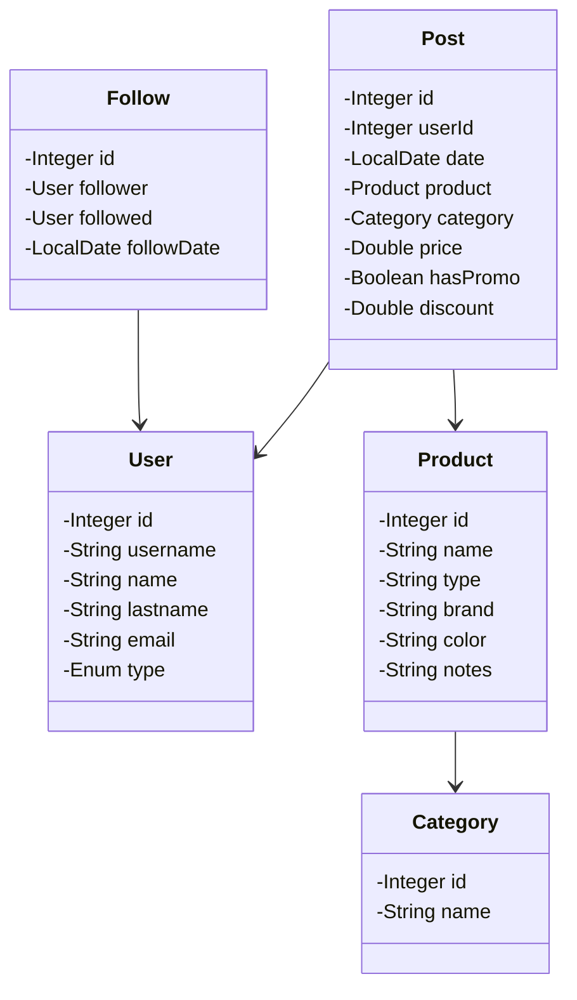

```mermaid

classDiagram
    class User {
        -Integer id
        -String username
        -String name
        -String lastname
        -String email
        -Enum type
    }
    class Follow {
        -Integer id
        -User follower
        -User followed
        -LocalDate followDate
    }
    class Product {
        -Integer id
        -String name
        -String type
        -String brand
        -String color
        -String notes
    }
    class Post {
        -Integer id
        -Integer userId
        -LocalDate date
        -Product product
        -Category category
        -Double price
        -Boolean hasPromo
        -Double discount
    }
    class Category {
        -Integer id
        -String name
    }
    Post --> Product
    Product --> Category
    Follow --> User
    Post --> User

```